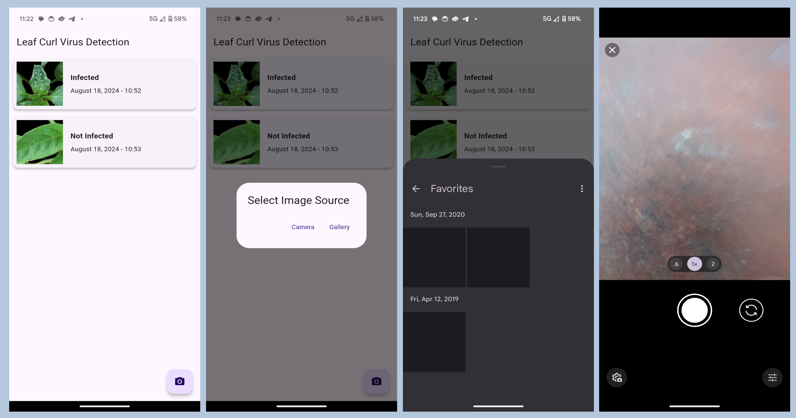

# Leaf Curl Virus Detection

This is a flutter app that uses our backend api to predict the presence of leaf curl virus in a plant using image of its leaf. The user needs to upload a cropped image for best performance

## Running this Project

This project is a initial version of application and many features are to be implemented.

for running the application setup flutter on your machine with a compatible physical/virtual device. For more info visit [this](https://docs.flutter.dev/get-started/install) site.

For running the project first clone the project using:

```
git clone https://github.com/dlsathvik04/LCVD-flutterapp.git
```

change directory to the repository root

```
cd LCVD-flutterapp
```

get the dependencies and run the project

```
flutter pub get
flutter run
```

### Building installable APK

in the project root run

```
flutter build apk --release
```

### Installing Pre built APK

Download and install the latest prebuilt APK from the [releases](https://github.com/dlsathvik04/LCVD-flutterapp/releases)


## Screen Shots


